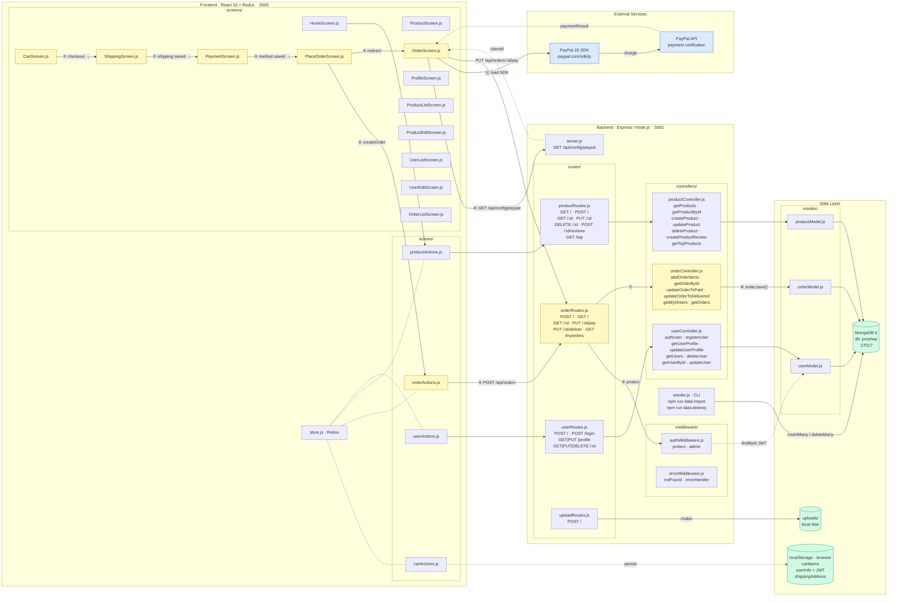

# Architecture — proshop_mern

## C4 Container Diagram

Use-case показан цифрами ①–⑪: **Покупатель оформляет заказ и оплачивает через PayPal**.

### Легенда

| Цвет | Значение |
|------|----------|
| 🟡 жёлтый | Use-case path: Checkout → PayPal payment |
| 🔵 синий | Внешние платёжные сервисы |
| 🟢 зелёный | Хранилища данных |

### Entry points (все)

| Файл | Тип | Методы / маршруты |
|------|-----|-------------------|
| `backend/controllers/orderController.js` | HTTP handler | `addOrderItems`, `getOrderById`, `updateOrderToPaid`, `updateOrderToDelivered`, `getMyOrders`, `getOrders` |
| `backend/controllers/productController.js` | HTTP handler | `getProducts`, `getProductById`, `createProduct`, `updateProduct`, `deleteProduct`, `createProductReview`, `getTopProducts` |
| `backend/controllers/userController.js` | HTTP handler | `authUser`, `registerUser`, `getUserProfile`, `updateUserProfile`, `getUsers`, `deleteUser`, `getUserById`, `updateUser` |
| `backend/routes/uploadRoutes.js` | HTTP handler | `POST /api/upload` (multer) |
| `backend/server.js` | HTTP handler | `GET /api/config/paypal` |
| `backend/seeder.js` | CLI | `npm run data:import`, `npm run data:destroy` |
